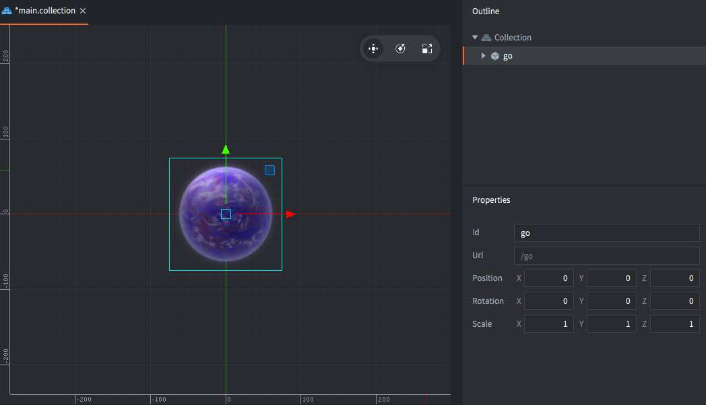
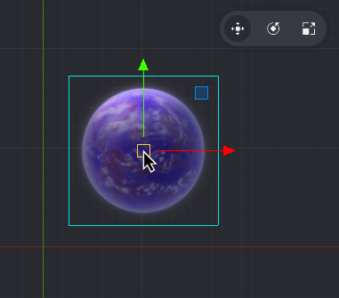

# 编辑器概览

编辑器允许你对游戏项目内的所有文件，进行高效的浏览和操作。在合适的编辑器中编辑文件，并在独立界面显示所有的相关信息。

## 开始编辑

运行 Defold 时，将为你显示“快速打开项目”或“创建新项目”的视图。在左侧有三个视图选项。单击以选择要执行的操作：

Home（首页）
: 展示了打开过的项目，你可以由此快速进入对应项目。这是默认视图。

New（新建）
: 若需要新的 Defold 项目，需要先设置新项目的默认状态，点击对应的模版即可选择：基础模版（对应 *From Template* 分类），基于教程的引导模版（对应 *From Tutorial* 分类），或尝试其中一个示例项目（对应 *From Sample* 分类）。

  {srcset="images/editor/new_project@2x.png 2x"}

  当你创建了一个新项目，它将项目文件和你对项目的所有后续更新保存在本地硬盘上。如果你有小伙伴一起开发，打开项目后，菜单中的 File → *Synchronize*（分享）功能是你的最佳选择。你需要创建一个 Defold 帐号，它将使用 Defold 云的在线 Git 仓库，为你和你的团队存储与同步你们的项目。

Import project（导入项目）
: 从 Defold 云存储的 Git 仓库中创建项目的拷贝，这会将此项目与线上 Git 仓库所关联，并同步所有本地的改动。

  {srcset="images/editor/import_project@2x.png 2x"}

  授权 Defold 云存储的 Git 仓库，需要你提供你的 Defold 帐号作为凭证（截至我翻译此处时，这一流程是打开一个链接，并登录帐号来完成授权）。

这只是入门概述，从 [项目设置](https://www.defold.com/manuals/project-setup/) 中，你能学到更多选项。

## 编辑器界面

Defold 编辑器采用常见的多视图界面，在每个视图内显示对应的信息。

*Assets* （资源）视图
: 列出属于该项目的全部文件。点击或滚动导航条，所有的文件 oriented operations can be made in this view:

   - <kbd>双击</kbd>一个文件，将使用对应的编辑器打开它。
   - <kbd>拖动</kbd>可以增加文件到你的项目，或移动文件或文件夹到项目的其他位置。
   - <kbd>右键</kbd>将打开 _快捷菜单_，你能以此对文件或文件夹进行创建、重命名、删除或跟踪文件依赖等更多的操作。

*Editor* （编辑器）视图

: 这是主要视图，它按类型展示当前打开的文件。在这里，允许您移动视图展示的方式：

- 平移: <kbd>Alt + 鼠标左键</kbd>.
- 缩放: <kbd>Alt + 鼠标右键</kbd> （多键鼠标） 或 <kbd>Ctrl + 鼠标键</kbd> （单键鼠标）。 如果你的鼠标有中键（滑鼠），你可以直接用它进行缩放。
- 3D 旋转: <kbd>Ctrl + 鼠标左键</kbd>.

操作对象的工具条在场景视图的右上角，分别对应：*移动*，*旋转* 和 *缩放*。

{srcset="images/editor/toolbar@2x.png 2x"}

*Outline* （结构）视图
: 这个视图通过结构树，来显示正在编辑的文件内容。The outline reflects the editor view and allows you to perform operations on your items:
   - <kbd>Click</kbd> 选中一个项目。Hold <kbd>Shift</kbd> or <kbd>Option</kbd> to expand the selection.
   - <kbd>Drag and drop</kbd> to move items. Drop a game object on another game object in a collection to child it.
   - <kbd>Right click</kbd> to open a _快捷菜单_ from where you can add items, delete selected items etc.

*Properties* （属性）视图
: This view shows properties associated with the currently selected item, like Position, Rotation, Animation etc, etc.

*Console* （控制台）视图
: This view shows any error output or purposeful printing that you do while your game is running. Alongside the console are tabs containing the *Curve Editor* which is used when editing curves in the particle editor, the *Build Errors* view that shows build errors, and the *Search Results* view that displays search results. The console is also used for interacting with the integrated debugger.

*Changed Files* （文件变更）视图
: This view lists any files that has been changed, added or deleted in your project. By synchronizing the project regularly you can bring your local copy in sync with what is stored in the project Git repository, that way you can collaborate within a team, and you won’t lose your work if unfortune strikes. Some file oriented operations can be performed in this view:

   - <kbd>Double click</kbd> a file to open a diff view of the file. Editor 2 opens the file in a suitable editor, just like in the assets view.
   - <kbd>Right click</kbd> a file to open a pop up menu from where you can open a diff view, revert all changes done to the file, find the file on the filesystem and more (editor 2).

## Side-by-side editing

If you have multiple files open, a separate tab for each file is shown at the top of the editor view. It is possible to open 2 editor views side by side. <kbd>Right click</kbd> the tab for the editor you want to move and select <kbd>Move to Other Tab Pane</kbd>.

{srcset="images/editor/2-panes@2x.png 2x"}

You can also use the tab menu to swap the position of the two panes and join them to a single pane.

## The scene editor

Double clicking a collection or game object file brings up the *Scene Editor*:

Selecting objects
: Click on objects in the main window to select them. The rectangle surrounding the object in the editor view will highlight green to indicate what item is selected. The selected object is also highlighted in the *Outline* view.

  You can also select objects by:

  - <kbd>Click and drag</kbd> to select all objects inside the selection region.
  - <kbd>Click</kbd> objects in the Outline view.

  Hold <kbd>Shift</kbd> or <kbd>⌘</kbd> (Mac) / <kbd>Ctrl</kbd> (Win/Linux) while clicking to expand the selection.

The move tool
: {.left}
  To move objects, use the *Move Tool*. You find it in the toolbar in the top right corner of the scene editor, or by pressing the <kbd>W</kbd> key.

  

  The selected object shows a set of manipulators (squares and arrows). Click and drag the green center square handle to move the object freely in screen space, click and drag the arrows to move the object along the X, Y or Z-axis. There arn also square handles for moving the object in the X-Y plane and (visible if rotating the camera in 3D) for moving the object in the X-Z and Y-Z planes.

The rotate tool
: {.left}
  To rotate objects, use the *Rotate Tool* by selecting it in the toolbar, or by pressing the <kbd>E</kbd> key.

  

  This tool consists of four circular manipulators. An orange manipulator that rotates the object in screen space and one for rotation around each of the X, Y and Z axes. Since the view is peripendicular to the X- and Y-axis, the circles only appear as two lines crossing the object.

The scale tool
: {.left}
  To scale objects, use the *Scale Tool* by selecting it in the toolbar, or by pressing the <kbd>R</kbd> key.

  

  This tool consists of a set of square handles. The center one scales the object uniformly in all axes (including Z). There also one handle for scaling along each of the X, Y and Z axes and one handle for scaling in the X-Y plane, the X-Z plane and the Y-Z plane.

## 创建新的项目文件

To create new resource files, either select <kbd>File ▸ New...</kbd> and then choose the file type from the menu, or use the 快捷菜单:

<kbd>Right click</kbd> the target location in the *Assets* browser, then select <kbd>New... ▸ [file type]</kbd>:

{srcset="images/editor/create_file@2x.png 2x"}

Type a suitable name for the new file. The full file name including the file type suffix is shown under *Path* in the dialog:

{srcset="images/editor/create_file_name@2x.png 2x"}

## 导入文件到项目

关于增加资源文件（图片、音频或模块等）到你的项目中，将它们直接拖拽到 *Assets* 视图的正确位置即可。这将从原处创建一个 _备份_ 到项目结构的对应地点。

{srcset="images/editor/import@2x.png 2x"}
