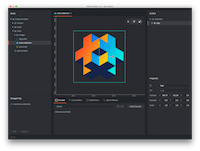
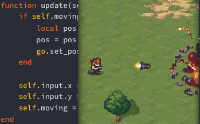

# Welcome to Defold

Defold 是一个专业的游戏开发平台，帮助游戏团队策划、开发并 _发布_ 游戏。它没有也不提供“全面而复杂”的解决方案。恰恰相反，我们认为 Defold 的意义为游戏团队提供一个简单高效的协作工具。这意味着你将承担多一些的工作；作为奖赏，你的工具套件将更为贴合你（/团队）的工作流程。

无论你是个萌新，或是熟练的开发者，理解我们的一些理念，都可能需要一些时间。我们鼓励你进行实践式学习，跟随教程，阅读我们的手册与 API 文档，积极的参与论坛——向其他用户讨教、观察 Defold 的发展路线。

## 第一步?

你可以得到相当多的文档，它们构成了整个手册、API 参考文档、样例及教程。如果你不知道从何开始，这里提供一些起点:

编辑器概况
: {.left} [编辑器预览](/manuals/editor/) 是一个关于编辑器的优秀介绍，有效地帮助你熟悉这一切。如果你熟悉 3D 建模软件或编程 IDE，这会令你感到熟悉，但仍有不同之处。

一些简单案例
: {.left} [我们整理的简单案例](/examples/) 是比较好的介绍，作为怎样组合 Defold 部件并使其按你的设想去工作。你将通过最简案例学到：如何在 Defold 实现你的实际需求。

Lua 语言
: {.left} [Defold 使用 Lua 语言](/manuals/lua/) 做逻辑控制，而引擎采用 C++ 编写以便获得最优效率，这一切都需要高级语言 Lua。如果你有 Python、Javascript 或其他高级语言的编写经验，你将发现 Lua 非常好掌握，并跟随教程。否则，请保持一些耐心去率先学习它。

内置游戏教程
: {.left} 我们相信你愿意通过实践学习最佳做法。这也是我们在 [编辑器](/manuals/editor/) 内，提供了“多级别的各种技能”的案例教程的缘由。启动编辑器，并通过一到两个教程来学习怎样 Defold 如何运作。

Defold 的独特：模块化
: {.left} [Defold games are build by composing simple blocks](/manuals/building-blocks/), some of which seem familiar if you have used other engines. There are some architectural design decisions that make the blocks of Defold special and it takes a little while to be comfortable working with them. Our building blocks manual is a good start if you feel you need to understand thoroughly how it's working.

: {.left} [Defold 游戏是通过基本模块组装构成的](/manuals/building-blocks/)，如果你使用过其他引擎，你会有一些熟悉感。通过融入一些建筑学的理念，这让 Defold 的模块化略显特别，所以当你想让它们顺畅工作，这需要投入一点时间来学习。如果你感到你需要理解它的工作原理，“构建模块手册”将是一个良好的开端。

论坛
: {.left} [向他人学习](//forum.defold.com/) 通常是良好的学习路径。我们的社区很友好，并相当了解构建游戏与 Defold 的知识。如果你遇到了困难，勿犹豫，请来社区寻求帮助吧！

请记住，无论你学习 Defold 的最佳路径是什么，你都可以重回这里，以便更深入的了解各类功能、Defold 的理念，并毫不犹豫地指出你无法理解和有谬误的地方。希望通过这些页面，让你与我们共同成长。

我们期待你使用 Defold 创造你下一个有趣游戏，并以此为乐！

