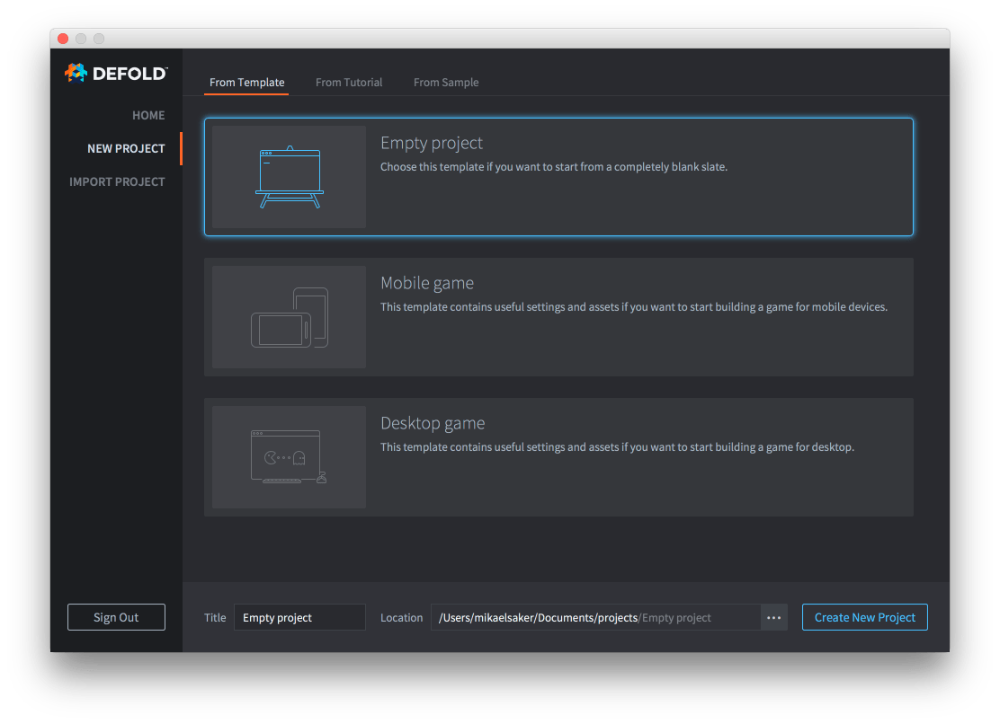
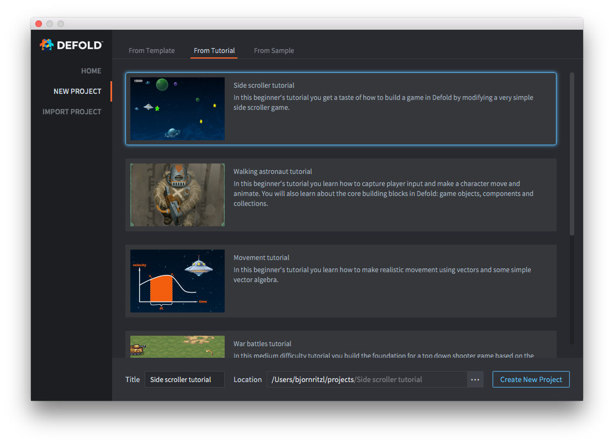
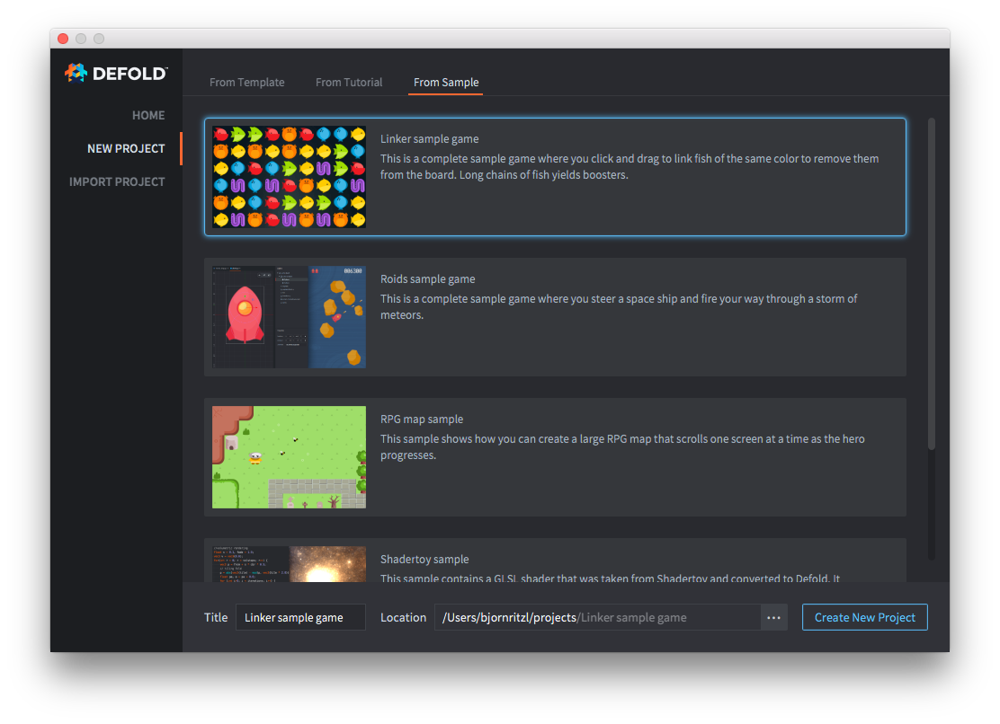
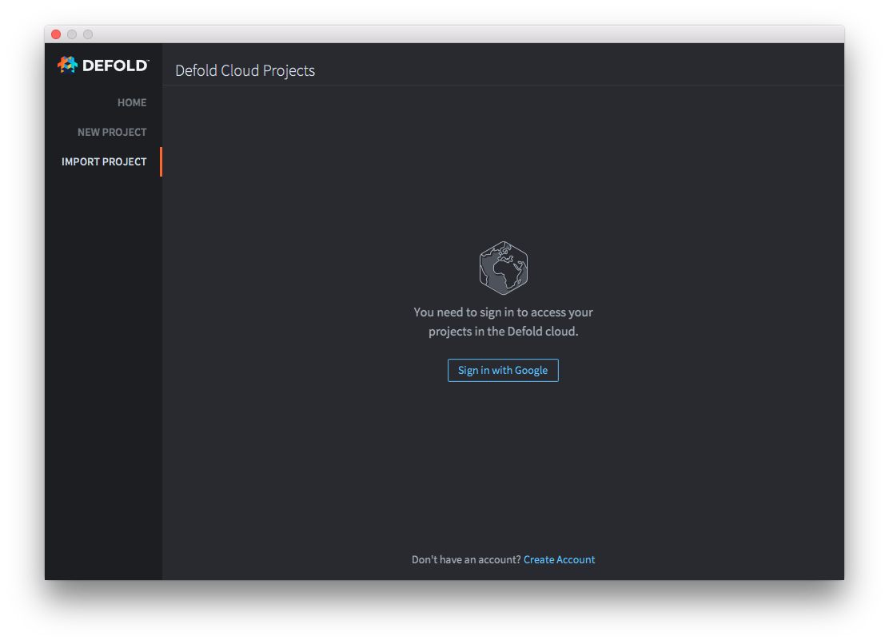

# Project setup

You can easily create a new project from within the Defold editor. You also have the option to import an existing project from the Defold dashboard as well as open an existing project already located on your computer.

## Creating a new local project

Click the <kbd>New Project</kbd> option and select what kind of project you would like to create. Specify a location on your hard drive where the project files will be stored. Click <kbd>Create New Project</kbd> to create the project in the location you've chosen. You can create a new project from a Template:

{srcset="images/workflow/open_project@2x.png 2x"}

Or from a Tutorial with step by step instructions:

Or from a finished Sample game:

### Adding the project to GitHub

A local project will have no integration with any version control system, meaning that the files reside only on your hard drive. Any changes you make to the files are permanent and there is no way to revert changes or recover deleted files. It is recommended to use a version control system such as Git to track changes to your files. This also makes it very easy to collaborate on a project with other people. Uploading a local project to GitHub can be done in just a few steps:

1. Create or login to an account on [GitHub](https://github.com/)
2. Create a repository using the [New Repository](https://help.github.com/en/articles/creating-a-new-repository) option
3. Upload all project files via the [Upload Files](https://help.github.com/en/articles/adding-a-file-to-a-repository) option

The project is now under version control and you should [clone the project](https://help.github.com/en/articles/cloning-a-repository) to your local hard drive and work from this new location instead.

## Importing a project

Click the <kbd>Import Project</kbd> option to bring up a list of Defold hosted projects that you have access to. If you are not already signed in you must first do so. Specify a location on your hard drive where the project files will be stored.

### Migrating a project to GitHub

You can migrate a Defold hosted project to GitHub by following [this guide from the Defold forum](https://forum.defold.com/t/howto-alternative-project-hosting/1309). This process will retain all of the commit history from the original repository.

## Open an existing project

Click the <kbd>Open From Disk</kbd> option to open a project already located on your computer.

## Open a recent project

Once a project has been opened once it will show up in the list of recent projects. The list will show the projects you have worked on most recently and it will allow you to quickly open any of the projects by double-clicking the project in the list.
